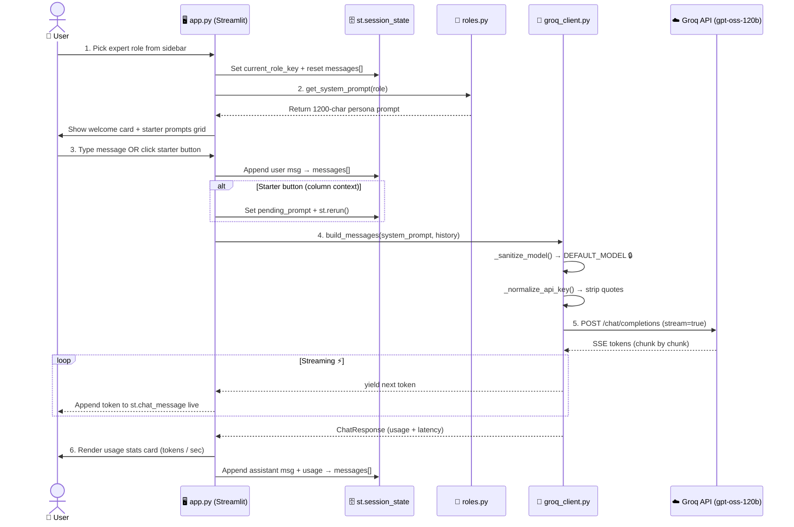

<div align="center">

# 🧠 Multi-Role AI Expert System

**Production-grade AI platform with 8 specialized expert personas, powered by Groq's lightning-fast inference API.**

[](https://multi-role-ai-expert-system.streamlit.app/)
[](#-tech-stack)
[](#-architecture)
[](#-license)
[](#-codespaces-setup)

**Live Demo →** [https://multi-role-ai-expert-system.streamlit.app/](https://multi-role-ai-expert-system.streamlit.app/)

---

</div>

## 📌 Table of Contents

- [✨ Overview](#-overview)
- [🎭 Expert Roles](#-expert-roles)
- [🛠️ Tech Stack](#️-tech-stack)
- [🏗️ Architecture](#️-architecture)
- [⚡ Features](#-features)
- [📁 Project Structure](#-project-structure)
- [🚀 Getting Started](#-getting-started)
  - [Prerequisites](#prerequisites)
  - [Local Setup (venv)](#local-setup-venv)
  - [Codespaces Setup](#codespaces-setup)
- [☁️ Deployment](#️-deployment)
  - [Step 1 — Push to GitHub](#step-1--push-to-github)
  - [Step 2 — Deploy to Streamlit Community Cloud](#step-2--deploy-to-streamlit-community-cloud)
- [🔧 Configuration](#-configuration)
- [🧩 Workflow Diagram](#-workflow-diagram)
- [🖼️ Output Images](#-output-images)
- [🔐 Security & Safeguards](#-security--safeguards)
- [🤝 Contributing](#-contributing)

---

## ✨ Overview

The **Multi-Role AI Expert System** is a production-ready conversational AI platform that transforms a single LLM into **8 domain-specific experts**. Built on Python, Streamlit, and Groq's ultra-fast inference API, it delivers senior-quality advisory across software engineering, data science, legal, marketing, finance, health, career coaching, and product management.

> 💡 **Why this exists?** Generic chatbots give generic answers. This system wraps the model in tightly-engineered **system prompts** (1100–1800 chars each) that force role-specific tone, structure, frameworks, and disclaimers — giving you advisor-grade output without fine-tuning.

---

## 🎭 Expert Roles

| # | Role | Key | Emoji | Primary Expertise |
|---|------|-----|:-----:|-------------------|
| 1 | **Software Engineer** | `software_engineer` | 💻 | Code, architecture, debugging, microservices, DevOps |
| 2 | **Data Scientist** | `data_scientist` | 📊 | ML/AI, statistics, EDA, A/B testing, predictive modeling |
| 3 | **Legal Advisor** | `legal_advisor` | ⚖️ | Contracts, compliance, IP, GDPR — with auto disclaimer |
| 4 | **Marketing Strategist** | `marketing_strategist` | 📈 | Branding, SEO, content, funnels, growth, analytics |
| 5 | **Financial Analyst** | `financial_analyst` | 💰 | DCF, valuation, 3-statement, budgeting, risk |
| 6 | **Health & Wellness Coach** | `health_coach` | 🏥 | Nutrition, fitness, sleep, stress — with medical disclaimer |
| 7 | **Career Coach** | `career_coach` | 🎯 | STAR resumes, interviews, negotiation, promotions |
| 8 | **Product Manager** | `product_manager` | 🧭 | PRDs, roadmaps, RICE prioritization, JTBD, discovery |

> 📘 Role definitions are fully extensible. Add a new expert with **one dictionary entry** in [roles.py](file:///c:/Users/LENOVO/Documents/Multi-Role%20AI%20Expert%20System/roles.py#L24-L331).

---

## 🛠️ Tech Stack

| Layer | Technology | Version | Purpose |
|-------|-----------|:-------:|---------|
| **Frontend / UI** | Streamlit | ≥1.28.0 | Declarative chat UI, state management, sidebar widgets |
| **LLM API** | Groq Cloud | — | OpenAI GPT-OSS-120B inference (~500 tokens/sec) |
| **SDK Wrapper** | `groq` | ≥0.4.0 | Official Groq Python SDK + typed wrapper |
| **Language** | Python | 3.11+ | Core logic, async streaming, error handling |
| **Env Management** | `python-dotenv` | ≥1.0.0 | Local `.env` fallback for API keys |
| **Dev Environment** | Dev Container | Python 3.11 Bookworm | One-click GitHub Codespaces setup |
| **Deployment** | Streamlit Community Cloud | — | Free serverless hosting via GitHub sync |

### 🤖 Model in Use

```
openai/gpt-oss-120b
```
> Selected as of **Aug 2026** — Groq's flagship open-weight MoE with a 131k context window and native support for tool use, reasoning, and code execution. Locked to a single model to **eliminate decommissioning errors** (Groq retires models frequently; see [Safeguards](#-security--safeguards)).

---

## 🏗️ Architecture

The project follows a **clean 3-tier modular architecture** with strict separation of concerns:

```
┌──────────────────────────────────────────────────────────────┐
│                     🖥️  STREAMLIT UI LAYER                   │
│  app.py  →  Sidebar / Chat / State / Routing / Rendering     │
└────────────────────────────┬─────────────────────────────────┘
                             │  typed helper calls
                             ▼
┌──────────────────────────────────────────────────────────────┐
│                    🧩  DOMAIN & PERSONA LAYER                │
│  roles.py  →  8 Persona Definitions / System Prompts / APIs  │
└────────────────────────────┬─────────────────────────────────┘
                             │  build_messages(system_prompt)
                             ▼
┌──────────────────────────────────────────────────────────────┐
│                     🔌  SDK / API BOUNDARY                   │
│  groq_client.py  →  GroqClient + _sanitize_model() + errors  │
└────────────────────────────┬─────────────────────────────────┘
                             │  REST (Groq SDK)
                             ▼
                    ☁️  GROQ CLOUD (gpt-oss-120b)
```

### Key Modules

| Module | Lines | Responsibility |
|--------|:-----:|----------------|
| [app.py](file:///c:/Users/LENOVO/Documents/Multi-Role%20AI%20Expert%20System/app.py) | ~550 | Streamlit entry point, session state, sidebar, chat UI, streaming rendering |
| [roles.py](file:///c:/Users/LENOVO/Documents/Multi-Role%20AI%20Expert%20System/roles.py) | ~390 | 8 expert personas (name/icon/description/system_prompt) + helper functions |
| [groq_client.py](file:///c:/Users/LENOVO/Documents/Multi-Role%20AI%20Expert%20System/groq_client.py) | ~450 | Typed wrapper: error hierarchy, key discovery, message building, chat/chat_stream |

---

## ⚡ Features

### 🚀 Core Capabilities
- **🎛️ One-click role switching** — Swap personas from the sidebar; conversation auto-resets (system prompts are incompatible across roles)
- **⚡ Real-time token streaming** — Responses render word-by-word via Groq SSE (`yield` generator in [chat_stream](file:///c:/Users/LENOVO/Documents/Multi-Role%20AI%20Expert%20System/groq_client.py))
- **📊 Per-response telemetry** — Token count, latency (s), and tokens/sec shown after every answer
- **🎯 Role-specific starter prompts** — 2×2 grid of curated prompts appears on role change
- **⚙️ Tunable generation** — Temperature & max_tokens sliders in Advanced Settings
- **🧠 Typed error hierarchy** — Distinct UI banners for auth / rate-limit / decommission / validation / service errors

### 🛡️ Production Safeguards
- **4-layer model lock** — Can never accidentally send a decommissioned model to Groq
- **API key normalization** — Auto-strips surrounding quotes from copy-pasted TOML secrets
- **No caching traps** — Module-level singleton (not `@st.cache_resource`) for the API client; retries succeed on rerun
- **Secrets never leak** — `.streamlit/secrets.toml` hard-listed in [.gitignore](file:///c:/Users/LENOVO/Documents/Multi-Role%20AI%20Expert%20System/.gitignore#L66)

---

## 📁 Project Structure

```
Multi-Role AI Expert System/
├── 🐍 app.py                          # Streamlit UI + state + chat logic (entry point)
├── 🐍 roles.py                        # 8 expert personas + system prompts
├── 🐍 groq_client.py                  # Groq API wrapper (typed errors, streaming, model lock)
├── 📋 requirements.txt                # pip dependencies
├── 📖 README.md                       # This file
├── .gitignore                         # Excludes venv, secrets, __pycache__, logs
├── .streamlit/
│   ├── config.toml                    # Streamlit theming + server config
│   └── secrets.toml  🔒               # GROQ_API_KEY (local only — NEVER committed)
└── .devcontainer/
    └── devcontainer.json              # GitHub Codespaces one-click setup
```

---

## 🚀 Getting Started

### Prerequisites

| Requirement | Minimum | Check with |
|-------------|:-------:|------------|
| Python | 3.11 | `python --version` |
| pip | 23.0 | `pip --version` |
| Groq API Key | — | [console.groq.com/keys](https://console.groq.com/keys) (free tier available) |

---

### Local Setup (venv)

> 💻 **Windows PowerShell** commands shown. Adjust `source venv/bin/activate` for macOS/Linux.

#### Step 1 — Clone & enter

```powershell
git clone https://github.com/Umesh-L/Multi-Role_AI_Expert_System.git
cd "Multi-Role AI Expert System"
```

#### Step 2 — Create & activate virtual environment

```powershell
python -m venv venv
.\venv\Scripts\Activate          # macOS/Linux: source venv/bin/activate
```

#### Step 3 — Install dependencies

```powershell
pip install --upgrade pip
pip install -r requirements.txt
```

#### Step 4 — Configure your Groq API key

Create the `.streamlit` folder and secrets file:

```powershell
mkdir .streamlit
```

Then create **`.streamlit/secrets.toml`** with:

```toml
GROQ_API_KEY = "gsk_YOUR_API_KEY_HERE"
```

> 🔑 Get your key from → [console.groq.com/keys](https://console.groq.com/keys)

#### Step 5 — Launch the app

```powershell
streamlit run app.py
```

The browser opens automatically at **`http://localhost:8501`** 🎉

---

### Codespaces Setup

[](https://codespaces.new/Umesh-L/Multi-Role_AI_Expert_System)

The repo ships with a preconfigured `.devcontainer/devcontainer.json`:
- Base image: `mcr.microsoft.com/devcontainers/python:1-3.11-bookworm`
- Auto-installs `requirements.txt` on container build
- Opens **README.md** and **app.py** automatically
- Exposes port **8501** with auto-forward preview
- Post-attach command: `streamlit run app.py --server.enableCORS false --server.enableXsrfProtection false`

> 🔐 In Codespaces, add `GROQ_API_KEY` via **Repository Secrets → Codespaces** or paste it into the running container's `.streamlit/secrets.toml`.

---

## ☁️ Deployment

### Step 1 — Push to GitHub

If you haven't already:

```powershell
cd "c:\Users\LENOVO\Documents\Multi-Role AI Expert System"
git init
git add .
git commit -m "Initial commit: Multi-Role AI Expert System"
git branch -M main
git remote add origin https://github.com/<YOUR_USERNAME>/<REPO_NAME>.git
git push -u origin main
```

### Step 2 — Deploy to Streamlit Community Cloud

| # | Action | Screenshot Hint |
|---|--------|-----------------|
| 1 | Go to **[share.streamlit.io](https://share.streamlit.io)** and sign in with GitHub | Connect your GH account |
| 2 | Click **🎛️ New app** → Select your repo → Select branch `main` | |
| 3 | **Main file path** → type `app.py` | |
| 4 | Click **⚙️ Advanced settings…** → open the **🔐 Secrets** tab | |
| 5 | Paste: <br>`GROQ_API_KEY = "gsk_YOUR_API_KEY_HERE"` | One key per line, TOML format |
| 6 | Click **🚀 Deploy!** | Boots in ~90 seconds |

> ✅ **Live link** for this project → [https://multi-role-ai-expert-system.streamlit.app/](https://multi-role-ai-expert-system.streamlit.app/)

---

## 🔧 Configuration

### ⚙️ Advanced Settings (UI)

| Setting | Default | Range | Description |
|---------|:-------:|:-----:|-------------|
| **Model** | `openai/gpt-oss-120b` | 🔒 Locked | Single fixed model to prevent decommission errors |
| **Temperature** | `0.7` | `0.0 – 1.5` | Creativity: low = deterministic, high = imaginative |
| **Max Tokens** | `4096` | `256 – 8192` | Upper bound on response length per turn |
| **Stream Mode** | ✅ On | bool | Render tokens as they arrive vs show full response |

### 🎨 Streamlit Theming ([.streamlit/config.toml](file:///c:/Users/LENOVO/Documents/Multi-Role%20AI%20Expert%20System/.streamlit/config.toml))

```toml
[theme]
base         = "light"
primaryColor = "#6c5ce7"     # Purple
backgroundColor = "#ffffff"
secondaryBackgroundColor = "#f5f3ff"
textColor    = "#1a1a2e"
font         = "sans serif"

[server]
maxUploadSize = 10
headless      = true
```

---

## 🧩 Workflow Diagram


---

## 🖼️ Output Images


---

## 🔐 Security & Safeguards

### 4-Layer Model Lock (Prevents Decommission Errors)

Groq retires models frequently (e.g., `llama-3.1-70b-versatile` on 2026-08-16). The app has **four independent defenses** against HTTP 400 `model_decommissioned`:

| Layer | Location | What it does |
|-------|----------|--------------|
| ① Source of Truth | [groq_client.py#L39-L57](file:///c:/Users/LENOVO/Documents/Multi-Role%20AI%20Expert%20System/groq_client.py#L39-L57) | `DEFAULT_MODEL` single constant + `COMMON_GROQ_MODELS` collapsed to 1 entry |
| ② Session Sanitizer | [app.py#L100](file:///c:/Users/LENOVO/Documents/Multi-Role%20AI%20Expert%20System/app.py#L100) | `st.session_state.model = DEFAULT_MODEL` — unconditional overwrite EVERY rerun |
| ③ UI Lock | [app.py sidebar](file:///c:/Users/LENOVO/Documents/Multi-Role%20AI%20Expert%20System/app.py) | Static read-only info card replaces `st.selectbox` — no user model choice |
| ④ Call-Site Hardcode | [app.py `run_user_prompt()`](file:///c:/Users/LENOVO/Documents/Multi-Role%20AI%20Expert%20System/app.py) | `model=DEFAULT_MODEL` explicitly passed to `.chat_stream()` / `.chat()` — SDK prefers kwarg |

### Other Security Measures

| Concern | Mitigation |
|---------|-----------|
| **Secrets exposure** | `.streamlit/secrets.toml` in `.gitignore`; Streamlit Cloud secrets only via dashboard |
| **Cache poisoning** | Module-level singleton for `GroqClient` (not `@st.cache_resource`) — retries work on rerun |
| **TOML quote artifacts** | `_normalize_api_key()` strips `"..."` and `'...'` from user-pasted secrets |
| **Role bleed** | Role change → auto conversation reset; system prompt re-injected at every message build |

---

## 🤝 Contributing

Contributions welcome! Here's how to add a new expert role in **30 seconds**:

1. Open [roles.py](file:///c:/Users/LENOVO/Documents/Multi-Role%20AI%20Expert%20System/roles.py#L24-L331)
2. Add a new entry to the `ROLES` dict:

```python
"your_new_role": {
    "name": "Role Display Name",
    "icon": "🎨",
    "description": "One-line expertise summary shown in sidebar.",
    "system_prompt": """You are a senior <ROLE> with 15+ years…""".strip(),
},
```

3. Done. The sidebar picker, welcome header, and starter prompts grid auto-update.

---

<div align="center">

**Made with** 🧠 **by Umesh L**

[🌟 Star on GitHub](https://github.com/Umesh-L/Multi-Role_AI_Expert_System) ·
[🌐 Live Demo](https://multi-role-ai-expert-system.streamlit.app/) ·
[🐛 Report Issues](https://github.com/Umesh-L/Multi-Role_AI_Expert_System/issues)

</div>
